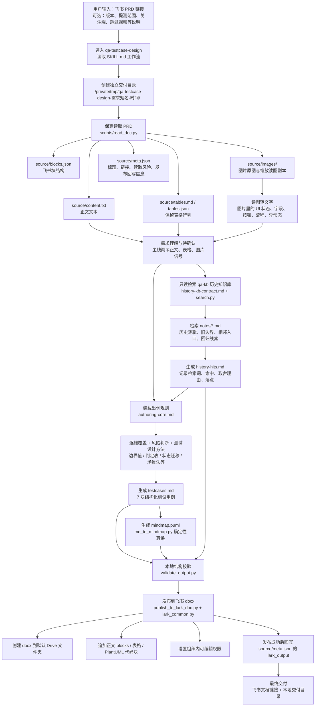

# QA 测试用例生成与飞书发布链路投产报告

> 日期：2026-07-07  
> 适用对象：QA 负责人、测试团队、产品/研发协作方  
> 一句话说明：输入一篇飞书 PRD 链接，系统会读取需求正文、表格、图片，检索历史需求知识，生成结构化测试用例、历史命中证据、PlantUML 思维导图，并发布为新的飞书文档。

---

## 1. 结论摘要

当前链路已经具备投产使用条件，核心闭环是：

```text
飞书 PRD 链接
→ 保真读取正文 / 表格 / 图片
→ 只读检索历史知识库
→ 生成结构化测试用例
→ 生成 PlantUML 思维导图
→ 本地结构校验
→ 新建飞书 docx 文档发布
```

它解决的不是“把 PRD 原文拆成条目”，而是“把本次需求、历史逻辑、覆盖清单、测试设计方法一起编译成可执行测试用例”。

当前正式使用的本地 skill 有两个：

| Skill | 定位 | 是否在正式链路中使用 |
|---|---|---|
| `qa-testcase-design` | 主流水线：读取需求、设计用例、生成导图、发布飞书文档 | 是 |
| `qa-knowledge-base` | 历史需求知识库：写用例前只读检索历史逻辑和回归点 | 是 |

另有一个通用能力需要说明：

| Skill | 定位 | 本链路关系 |
|---|---|---|
| `giggle:lark-docs` | 通用飞书文档 OpenAPI 操作说明 | 作为飞书能力参考；当前投产链路没有直接依赖它 |

飞书发布目前由 `qa-testcase-design` 内置脚本直接调用 Lark OpenAPI，不再走旧的 Giggle 网关登录链路。

---

## 2. 端到端流程图



大白话解释：

1. 用户只需要给一条飞书 PRD 链接。
2. 系统先把 PRD 原样读下来，正文、表格、图片都保留。
3. 再去本地历史知识库里找相关旧需求，避免漏掉老逻辑和回归点。
4. 然后按测试方法和覆盖清单生成测试用例，不是简单摘要。
5. 生成后先用脚本检查结构是否合格。
6. 合格后新建一篇飞书文档，把用例和导图代码块发布进去。

---

## 3. 从链接到飞书文档：每个阶段调用哪些文件

### 阶段 1：接收需求并创建交付目录

| 调用文件 | 作用 |
|---|---|
| `~/.codex/skills/qa-testcase-design/SKILL.md` | 主入口。定义 8 步工作流、边界、质量门槛、默认要发布飞书文档。 |
| `~/.codex/skills/qa-testcase-design/references/output-files.md` | 定义交付目录命名、必产文件、校验命令、发布前置条件。 |

产出目录示例：

```text
/private/tmp/qa-testcase-design-<需求短名>-<YYYYMMDD-HHMM>/
```

该目录是一次任务的完整工作区，避免多次生成互相覆盖。

### 阶段 2：读取飞书 PRD

| 调用文件 | 作用 |
|---|---|
| `scripts/read_doc.py` | 读取飞书 wiki/docx，拉正文、表格、块结构、图片。 |
| `scripts/lark_common.py` | 提供飞书凭证读取、tenant_access_token 获取、HTTP 请求封装。 |

读取产物：

| 文件/目录 | 内容 |
|---|---|
| `source/content.txt` | PRD 正文文本，含图片占位编号。 |
| `source/tables.md` | Markdown 表格，保留原 PRD 表格行列。 |
| `source/tables.json` | 结构化表格数据。 |
| `source/blocks.json` | 飞书原始 block 结构，用于排查未解析内容。 |
| `source/images/` | PRD 中的图片原图；超大图会有 `.read` 缩放副本。 |
| `source/meta.json` | 标题、链接、读取统计、未解析块、后续发布信息。 |

关键设计：

- 表格必须保行列，因为状态分支、数值边界、判定条件通常藏在表格里。
- 图片不能丢，因为 UI 状态、按钮、文案、流程图、异常态往往只在图里。
- 未解析块，例如附件、多维表格、iframe、视频，会登记为读取风险，不静默忽略。

### 阶段 3：需求理解与读图合流

| 调用文件 | 作用 |
|---|---|
| `source/content.txt` | 主线理解需求目标、入口、路径、状态、端范围。 |
| `source/tables.md` | 提取判定表、状态迁移、边界值、配置项。 |
| `source/images/` | 读取图片里的 UI、字段、按钮、流程、异常状态。 |
| `images-notes.md` | 有图片时生成的读图转录，记录每张图对用例的信号。 |

这一阶段的核心不是复述 PRD，而是把需求转成测试视角：

- 用户从哪里进？
- 做什么动作？
- 有哪些状态？
- 哪些端受影响？
- 哪些配置、AB、接口、埋点没有写清？
- 哪些信息只在图片或表格里？

### 阶段 4：只读检索历史知识库

| 调用文件 | 作用 |
|---|---|
| `~/.codex/skills/qa-testcase-design/references/history-kb-contract.md` | 定义如何只读使用 qa-knowledge-base、检索哪些词、如何记录证据。 |
| `/Users/dong/.codex/skills/qa-knowledge-base/scripts/search.py` | 按关键词、模块、版本检索历史需求笔记。 |
| `/Users/dong/.codex/skills/qa-knowledge-base/notes/*.md` | 历史需求结构化笔记，是主要阅读对象。 |
| `/Users/dong/.codex/skills/qa-knowledge-base/raw/` | 当 notes 信息不足时，回看原始 PRD 抓取结果。 |
| `history-hits.md` | 本次历史检索证据：检索词、命中、保留/丢弃理由、编入位置。 |

检索最少覆盖四类词：

| 词组 | 例子 | 目的 |
|---|---|---|
| 模块词 | 排行榜、语音识别、奖励中心 | 找同模块旧逻辑。 |
| 功能词 | 预加载、跟读反馈、排行榜动效 | 找同功能历史边界。 |
| 字段/埋点/配置词 | `level_number`、AB 名、配置名 | 找数据链路和埋点回归点。 |
| 相邻入口词 | Unity、课程详情页、Android、H5 | 找共用入口或端侧影响。 |

规则：

- `qa-testcase-design` 只读 `qa-knowledge-base`，不写入、不更新、不迁移。
- `search.py` 只负责召回，保留命中必须深读 `notes/*.md`。
- 历史资料不能覆盖本次 PRD；冲突进入“风险与待确认”。
- 每条保留历史线索必须落到用例、风险判断、待确认或覆盖自检表。

### 阶段 5：生成测试用例

| 调用文件 | 作用 |
|---|---|
| `references/authoring-core.md` | 出例核心手册，合并覆盖维度、测试设计方法、7 块结构规则。 |
| `references/code-risk-backend.md` | 涉及后端接口、奖励、计数、配置、数据一致性时读取。 |
| `references/code-risk-unity.md` | 涉及 Unity 课程、动画、资源加载、性能、课中状态时读取。 |
| `references/code-risk-native.md` | 涉及 Android/iOS 权限、推送、录音、登录态、生命周期时读取。 |
| `references/code-risk-h5.md` | 涉及 H5/WebView、bridge、缓存、离线包、i18n、埋点时读取。 |

测试用例采用固定 7 块结构：

1. 需求理解
2. 风险判断
3. showcase（提测准入）
4. 用例设计（按业务功能 / 需求类目组织）
5. APP 常驻维度补充
6. 风险与待确认
7. 覆盖自检表

核心规则：

- P0/P1/P2 只是用例 ID 和执行优先级，不作为正文一级目录。
- 正文用例按业务功能、需求类目、状态机组织。
- 每条用例必须可执行，包含前置、步骤、期望。
- 缺失信息集中进入“风险与待确认”，不在用例里编造。
- 覆盖自检表必须覆盖每条用例 ID。

### 阶段 6：生成思维导图

| 调用文件 | 作用 |
|---|---|
| `scripts/md_to_mindmap.py` | 把 `testcases.md` 确定性转换成 PlantUML mindmap。 |
| `references/mindmap-plantuml.md` | 定义导图层级、清洗规则、飞书画板粘贴注意事项。 |
| `mindmap.puml` | 最终可复制到飞书画板的 PlantUML 文件。 |

导图不是 AI 手写，而是脚本从 `testcases.md` 转换，避免断行、重复、层级错误。

导图内容包括：

- showcase（提测准入）
- 业务功能用例
- APP 常驻维度：边界/兼容、跨端联动、后端/配置、AB、埋点、多语言兼容
- 每条用例下的前置、步骤、期望

导图不包含：

- 需求理解
- 风险判断
- 风险与待确认
- 覆盖自检表
- `history-hits.md`

### 阶段 7：结构校验

| 调用文件 | 作用 |
|---|---|
| `scripts/validate_output.py` | 校验 `testcases.md`、`history-hits.md`、`mindmap.puml` 的结构和 ID 引用。 |
| `references/output-files.md` | 定义校验命令和校验失败处理规则。 |

常见硬校验：

- 每条用例 ID 必须出现在覆盖自检表。
- `showcase（提测准入）` 必须有 1-5 条核心 case。
- APP 常驻维度不能缺失；无关也要写 N/A。
- 待确认用例必须在“风险与待确认”里有 Q 项。
- 历史命中如果判定“保留/待确认”，必须写清最终编入位置。
- 思维导图不能混入风险、历史附录、覆盖表等非导图内容。

### 阶段 8：发布到飞书文档

| 调用文件 | 作用 |
|---|---|
| `references/lark-output.md` | 飞书发布规则：默认目录、权限、呈现规则、失败处理。 |
| `scripts/publish_to_lark_doc.py` | 新建飞书 docx、写入正文块、表格、PlantUML 代码块、历史摘要。 |
| `scripts/lark_common.py` | 读取凭证、获取 `tenant_access_token`、发起 OpenAPI 请求。 |

默认发布目录：

```text
https://wsgh3q8mwfpp.sg.larksuite.com/drive/folder/IL00fkfpolXGovdWl4FlPRe1gyg
```

发布机制：

```text
LARK_APP_ID / LARK_APP_SECRET / LARK_DOMAIN
或 config 服务
→ tenant_access_token
→ POST /open-apis/docx/v1/documents 创建 docx
→ POST /blocks/{block_id}/children 追加普通块
→ POST /blocks/{block_id}/descendant 追加表格
→ PATCH /drive/v2/permissions/{doc_id}/public 设置权限
```

飞书文档中承载：

- `testcases.md` 的发布版正文
- `mindmap.puml` 的 PlantUML 代码块
- `history-hits.md` 的历史命中摘要
- 交付文件清单

发布原则：

- 每次新建 docx，不覆盖历史文档。
- 不修改原 PRD。
- 不写入 `qa-knowledge-base`。
- 发布失败不影响本地交付目录。
- 如果创建 docx 后追加内容失败，会报告半成品文档 ID，避免盲目重复创建。

---

## 4. 本地使用的 skill 与文件分级

## 4.1 `qa-testcase-design`：主流水线 skill

位置：

```text
/Users/dong/.codex/skills/qa-testcase-design/
```

职责：

- 读取飞书 PRD。
- 解析正文、表格、图片。
- 结合历史知识库和测试方法生成用例。
- 生成 PlantUML 思维导图。
- 校验交付结构。
- 发布到飞书文档。

### L0：入口文件

| 文件 | 作用 |
|---|---|
| `SKILL.md` | 主入口。定义工作流、边界、质量门槛、默认飞书发布要求。 |
| `DESIGN.md` | 设计说明。解释为什么采用“保真读取 + 历史编译 + 逐维覆盖 + 方法出例”。 |
| `PIPELINE.md` | 团队版链路说明。适合工程同事快速看文件调用关系。 |

### L1：每次正式出例都会用到的规则文件

| 文件 | 作用 |
|---|---|
| `references/authoring-core.md` | 出例核心手册。包括覆盖维度、测试设计方法、7 块骨架、用例格式、覆盖自检表规则。 |
| `references/output-files.md` | 交付目录、必产文件、校验命令、发布前置规则。 |
| `references/history-kb-contract.md` | 只读使用 qa-knowledge-base 的契约：检索词、命中筛选、深读 notes、证据文件格式。 |
| `references/lark-output.md` | 飞书发布规则：默认 Drive 文件夹、发布内容、权限、失败处理。 |

### L2：按需求命中才读取的风险库和格式规则

| 文件 | 什么时候用 | 作用 |
|---|---|---|
| `references/code-risk-backend.md` | 涉及后端、接口、奖励、计数、配置、数据一致性 | 补后端常见风险点。 |
| `references/code-risk-unity.md` | 涉及 Unity 玩法、课程资源、动画、音频视频、性能 | 补 Unity 端风险点。 |
| `references/code-risk-native.md` | 涉及 Android/iOS 权限、推送、录音、登录态、生命周期 | 补原生端风险点。 |
| `references/code-risk-h5.md` | 涉及 H5/WebView、bridge、缓存、离线包、i18n | 补 H5 容器风险点。 |
| `references/mindmap-plantuml.md` | 需要生成飞书画板用思维导图时 | 规定 PlantUML 层级、清洗规则、粘贴注意事项。 |

### L3：深度参考和排查文件

| 文件 | 作用 |
|---|---|
| `references/coverage-dimensions.md` | 覆盖维度原始文档；`authoring-core.md` 的来源之一。 |
| `references/case-schema.md` | 用例 7 块结构和字段规则原始文档。 |
| `references/test-design-methods.md` | 测试设计方法原始文档。 |
| `references/example-testcases.md` | 标准测试用例样例，校验失败或新人理解格式时看。 |
| `references/example-mindmap-rich.puml` | 富层级 PlantUML 导图样例。 |
| `references/example-output.md` | 兼容旧引用的索引文件。 |

### 脚本层

| 脚本 | 作用 |
|---|---|
| `scripts/read_doc.py` | 读取飞书文档，输出正文、表格、图片、meta。 |
| `scripts/lark_common.py` | 飞书凭证和 HTTP 请求共享库。 |
| `scripts/validate_output.py` | 校验测试用例、历史证据、导图结构。 |
| `scripts/md_to_mindmap.py` | 将 `testcases.md` 转成 `mindmap.puml`。 |
| `scripts/publish_to_lark_doc.py` | 新建并写入飞书 docx。 |

## 4.2 `qa-knowledge-base`：历史知识库 skill

薄入口位置：

```text
/Users/dong/.codex/skills/qa-knowledge-base/SKILL.md
```

本体位置：

```text
/Users/dong/.codex/skills/qa-knowledge-base/
```

职责：

- 作为历史需求知识库。
- 写用例前只读检索历史逻辑、旧边界、相邻入口、回归线索。
- 不负责直接生成用例。

### 入口与规则

| 文件 | 作用 |
|---|---|
| `SKILL.md` | qa-knowledge-base 本体规则。说明如何 ingest、如何检索、目录结构。 |
| `CLAUDE.md` / `AGENTS.md` | 项目约束：原料只读、目录规则、脚本日志、禁止覆盖等。 |
| `RESUME.md` | 当前进度和状态。记录已 ingest 篇数、模块范围、待办。 |
| `taxonomy.md` | 功能模块分类体系，检索和入库归类时使用。 |

### 数据层

| 目录/文件 | 作用 |
|---|---|
| `raw/` | 原料层。每篇飞书 PRD 的正文、表格、图片、meta，作为事实来源。 |
| `notes/` | 笔记层。每篇历史需求一份结构化 Markdown，是测试前检索的主要对象。 |
| `index/INDEX.md` | 索引层。按模块、版本、标题、摘要组织全库导航。 |
| `wiki/` | 编译层预留目录，当前不是主链路依赖。 |
| `docs/` | qa-knowledge-base 自身设计文档。 |

### 脚本层

| 脚本 | 作用 | 当前链路是否使用 |
|---|---|---|
| `scripts/search.py` | 检索历史笔记，支持关键词、模块、版本。 | 是 |
| `scripts/fetch.py` | 把新 PRD 抓取入库。 | 当前出例链路不自动调用 |
| `scripts/relate.py` | 计算笔记之间的 related 关联。 | 当前出例链路不自动调用 |
| `scripts/build_index.py` | 重建 `index/INDEX.md`。 | 当前出例链路不自动调用 |

当前知识库状态：

```text
已 ingest 46 篇 / 24 模块，覆盖 V1.29–V1.33。
```

这意味着当前用例设计不是从零开始，而是会带着已有需求历史和回归线索一起分析。

## 4.3 `giggle:lark-docs`：通用飞书文档 skill

位置：

```text
/Users/dong/.codex/plugins/cache/giggle-common-skills/giggle/0.4.15/skills/lark-docs/
```

它的作用是提供通用飞书 OpenAPI 操作说明，例如：

- 读取文档内容。
- 创建新文档。
- 设置文档权限。
- 追加文档块。
- 搜索文档。

但本投产链路中，飞书读写不是直接调用这个 skill，而是由 `qa-testcase-design/scripts/read_doc.py` 和 `publish_to_lark_doc.py` 自己完成。

原因：

- 当前测试用例链路需要专门处理表格、图片、PlantUML 代码块和发布呈现规则。
- 发布脚本已经与读取脚本共用 `lark_common.py`，读写凭证一致。
- 当前链路不再依赖 Giggle 网关或 CF Access 登录，减少外部登录状态带来的不稳定。

---

## 5. 设计思路

## 5.1 不是“摘要工具”，而是“测试设计编译器”

传统 AI 生成用例容易出现三个问题：

1. 只读正文，漏表格和图片。
2. 只看本次 PRD，漏历史逻辑和老路径回归。
3. 用例只是平铺清单，没有风险判断和测试方法。

当前设计把输入拆成四类信息：

```text
本次 PRD
+ 表格 / 图片里的隐含规则
+ qa-kb 历史需求知识
+ QA 覆盖清单与测试设计方法
= 可执行测试用例
```

所以它的目标不是“生成更多 case”，而是“少漏关键风险”。

## 5.2 四个质量支柱

| 支柱 | 解决什么问题 | 实现方式 |
|---|---|---|
| 保真读取 | PRD 表格、图片信息丢失 | `read_doc.py` 读取正文、表格、图片、blocks。 |
| 历史编译 | 忘记旧逻辑、旧入口、旧埋点 | `qa-knowledge-base/search.py` + 深读 `notes/*.md` + `history-hits.md`。 |
| 逐维过闸 | 常驻维度漏测 | `authoring-core.md` 覆盖维度 + `validate_output.py`。 |
| 方法出例 | 用例空泛、不可执行 | 边界值、判定表、状态迁移、场景法等方法先选后写。 |

## 5.3 为什么要本地文件化

当前选择纯文件架构，不上数据库和向量库，原因是：

- PRD、表格、图片、历史笔记都能落地可查。
- 任何结果都能回溯到本地文件。
- 规则和数据分层清楚，坏了能定位。
- `notes/`、`raw/`、`index/` 都可被人直接读，不被黑盒系统锁住。

文件分层：

```text
raw/      原料层：飞书原文、表格、图片，只读事实来源
notes/    笔记层：结构化历史需求笔记
index/    索引层：模块、版本、标题、摘要导航
wiki/     编译层预留：未来可做模块主题页
```

## 5.4 为什么发布为飞书 docx，而不是只给本地文件

本地文件是源交付物，飞书文档是协作交付物。

飞书 docx 的价值：

- 方便发给产品、研发、QA 评审。
- 能直接复制 PlantUML 代码块到飞书画板。
- 能沉淀到固定 Drive 文件夹。
- 不依赖用户打开本地目录。

但本地文件仍保留，原因是：

- 飞书发布失败时，本地交付不丢。
- `testcases.md`、`history-hits.md`、`mindmap.puml` 是可复验源文件。
- 后续可扩展到 Excel、XMind、用例管理平台。

---

## 6. 产出物说明

一次完整执行后，会有两类产出。

## 6.1 本地交付目录

示例：

```text
/private/tmp/qa-testcase-design-排行榜动效预加载-20260707-0956/
```

| 文件/目录 | 说明 |
|---|---|
| `testcases.md` | 完整测试用例正文，7 块结构。 |
| `history-hits.md` | 历史知识库检索证据。 |
| `mindmap.puml` | 可复制到飞书画板的 PlantUML 思维导图。 |
| `images-notes.md` | 图片转文字记录，有图片时生成。 |
| `source/` | PRD 读取原始产物，包括正文、表格、图片、meta。 |

## 6.2 飞书文档

飞书文档用于评审和沉淀，包含：

- 需求理解
- 风险判断
- 用例设计思维导图 PlantUML 代码块
- 风险与待确认
- 覆盖自检表
- 历史命中摘要
- 交付文件清单

导图使用方式：

```text
打开飞书发布文档
→ 复制「用例设计思维导图（PlantUML）」代码块
→ 打开飞书画板 PlantUML
→ 清空输入框
→ 粘贴一次
→ 渲染导图
```

---

## 7. 使用方法

## 7.1 最简单用法

用户输入：

```text
设计测试用例：<飞书 PRD 链接>
```

系统默认会：

1. 读取飞书 PRD。
2. 检索历史知识库。
3. 生成 `testcases.md`。
4. 生成 `history-hits.md`。
5. 生成 `mindmap.puml`。
6. 校验结构。
7. 发布飞书 docx。

最终回复包含：

- 飞书文档链接。
- 本地交付目录。
- 发布失败时的原因和本地文件路径。

## 7.2 带提测范围的用法

推荐写法：

```text
设计测试用例：<飞书 PRD 链接>
本次重点关注 Android + Unity，后端只改配置，不测视频。
```

好处：

- 能减少无关端风险库读取。
- 能更准确判断 P0/P1/P2。
- 能跳过不需要处理的附件或视频。

## 7.3 只本地输出

```text
设计测试用例：<飞书 PRD 链接>
只本地输出，不发布飞书。
```

适用于：

- 草稿阶段。
- 不希望产生飞书文档。
- 需要人工先 review 本地文件。

## 7.4 发布到指定飞书目录

```text
设计测试用例：<飞书 PRD 链接>
发布到这个飞书文件夹：<Drive 文件夹链接>
```

规则：

- 用户当次给了目录，就以当次目录为准。
- 没给目录，就使用默认 Drive 文件夹。

## 7.5 常见失败处理

| 失败点 | 表现 | 处理 |
|---|---|---|
| 读取飞书失败 | 连接超时、鉴权失败、图片下载失败 | 重试；图片失败需确认是否允许 `--allow-partial`。 |
| 未解析块 | PRD 内有附件、多维表格、iframe、视频 | 登记到风险与待确认；用户明确跳过则不处理。 |
| 历史库无命中 | `history-hits.md` 写未命中 | 继续出例，但覆盖自检表历史回归标 N/A。 |
| 校验失败 | 用例 ID、覆盖表、待确认项不一致 | 修本地文件后重跑校验，不交付坏结构。 |
| 飞书创建失败 | `stage=create_docx` | 报告 code/msg，本地文件仍有效。 |
| 飞书追加失败 | `stage=append_blocks`，可能已有 document_id | 报告半成品 doc ID，避免盲目重复创建。 |

---

## 8. 权限与飞书机器人说明

当前飞书发布使用的是 Lark Developer 自建应用能力：

```text
app_id + app_secret
→ tenant_access_token
→ Lark OpenAPI
```

需要的能力包括：

- 读取文档内容。
- 创建 docx。
- 编辑 docx blocks。
- 写入 Drive 文件夹。
- 设置文档链接权限。

当前不是用普通群机器人 webhook。普通 webhook 机器人只适合发群消息，不适合稳定创建和编辑飞书云文档。

当前默认 Drive 文件夹已经验证可以新建 docx。若后续迁移目录，需要确认：

- 应用对目标文件夹有写权限。
- 应用权限已经在开发者后台开通并发布。
- 使用的是 Drive 文件夹链接，而不是权限不足的 Wiki 节点。

---

## 9. 当前已知边界与后续优化

## 9.1 已知边界

| 边界 | 说明 |
|---|---|
| 不自动回写 qa-knowledge-base | 当前只读历史库，避免把未验证的新用例污染知识库。 |
| 不修改原 PRD | 只读取，不在原需求文档上写评论或改内容。 |
| 不覆盖历史飞书文档 | 每次发布新建 docx。 |
| 不直接生成飞书原生画板 | 当前写入 PlantUML 代码块，由用户复制到飞书画板。 |
| 不做用例管理平台 | 不负责执行状态、缺陷流转、自动化脚本。 |

## 9.2 建议优化

| 优化项 | 价值 |
|---|---|
| 飞书 OpenAPI 自动重试 | 降低网络 reset 导致的发布失败。 |
| append_blocks 断点续传 | 创建 docx 后失败时可继续写，不产生重复半成品。 |
| 发布批次更细 | 降低单次请求失败成本。 |
| 历史命中质量统计 | 统计哪些模块历史库价值最高，指导后续养库。 |
| 用例执行反馈回流机制 | 把真实缺陷、漏测点通过单独流程回流到 qa-knowledge-base。 |

---

## 10. 投产使用建议

建议团队按以下方式使用：

1. 每个新需求提测时，先输入飞书 PRD 链接生成测试用例。
2. 产品/研发评审飞书 docx 中的风险判断、待确认项和覆盖自检表。
3. QA 把 PlantUML 代码块粘到飞书画板，作为评审视图。
4. 测试执行时以 `testcases.md` 或飞书 docx 为准。
5. 测试后如果发现新缺陷、漏测点、历史回归点，再单独发起 qa-knowledge-base 入库，不自动污染知识库。

这套链路当前最适合的场景：

- Giggle Academy App / 后台 / H5 / Unity 相关产品需求。
- 需要跨端、配置、AB、埋点、历史回归一起考虑的需求。
- 需要产出可评审、可追溯、可沉淀的中文 QA 测试用例。

---

## 11. 一句话对外介绍

这是一套面向 Giggle Academy 的 QA 测试用例设计与发布链路：输入飞书 PRD 链接后，系统会保真读取正文、表格和图片，结合本地历史需求知识库与测试覆盖方法生成结构化用例，并自动发布为飞书评审文档，同时保留本地源文件用于校验、追溯和后续扩展。
