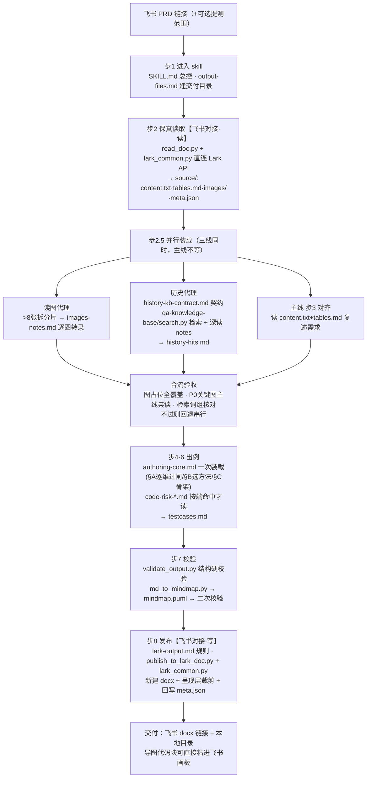

# qa-testcase-design 链路与文件说明（团队版）

> 版本 2026-07-09。给同事快速理解：一条飞书 PRD 链接如何变成飞书测试用例文档，链路调用了哪些文件、每个文件干什么、怎么用。
> 本版要点：①出例契约升级为**先树后例 + 原子用例**（分解树多级标题、一例一断言，校验有粒度闸+数值对账兜底）；②读取/发布支持**断点续跑**（`--resume`）；③发布态风险表「影响」列自动改写为维度名（文档内不再出现死引用的用例编号）。

## 一、端到端链路



链路只用到两个 skill：**qa-testcase-design**（主流水线）和 **qa-knowledge-base**（历史知识库，只读检索）。

## 二、飞书对接层（本链路自带，不依赖外部 skill）

对接飞书由 qa-testcase-design 自己的 3 个脚本完成，直连 Lark OpenAPI：

| 文件 | 职责 | 触发点 |
|---|---|---|
| `scripts/read_doc.py` | **读飞书**：拉正文+表格+下载全部图片+缩放副本（sips→PIL→头解析三级降级）；中断后 `--resume` 续跑只补缺 | 步 2 |
| `scripts/publish_to_lark_doc.py` | **写飞书**：新建 docx、呈现层裁剪、回写 meta；中断后 `--resume` 从断点续传不重复建档（进度存 `publish_state.json`） | 步 8 |
| `scripts/lark_common.py` | **凭证与 HTTP 共享库**：env → config 服务换 tenant_access_token；网络层错误自动重试 3 次 | 被上面两者调用 |

凭证机制：优先环境变量 `LARK_APP_ID/SECRET/DOMAIN`，缺失则拉 `skill-config.giggletools.com`（需 VPN）。**已不再走 giggle-common gateway / CF Access**。

> **辨析（避免同事混淆）**：系统里的 `giggle:lark-docs` 是通用飞书文档 skill，**本链路未使用**——自带脚本直连更快、凭证独立。`writing-lark-test-mindmaps` 已**完全弃用**，不在链路内。

## 三、Skill 目录逐文件说明

### 3.1 qa-testcase-design（主 · `~/.claude/skills/qa-testcase-design/`）

```
qa-testcase-design/
├── SKILL.md                    【L0 入口·自动加载】8步工作流+步2.5并行装载+边界红线（不编造/只读qa-knowledge-base/不改PRD）
├── PIPELINE.md                 本文件：团队版链路与文件说明
├── DESIGN.md                   设计决策记录（为什么这样设计），改流程前先读
├── references/
│   ├── authoring-core.md       【L1 每次必读·出例核心手册】§A覆盖维度+风险库触发表 / §B测试设计方法+特征→方法决策表 / §C 7块骨架+**先树后例分解树+原子用例**+showcase+优先级+自检表全部硬规则
│   ├── output-files.md         【L1】交付目录命名·必产文件清单·校验命令·校验失败修法
│   ├── history-kb-contract.md  【L1】qa-knowledge-base只读契约：检索词最小组·命中筛选标准·深读要求·证据格式
│   ├── lark-output.md          【L1】发布规则：默认Drive目录·凭证·呈现层裁剪·失败处理
│   ├── code-risk-backend.md    【L2 命中才读】后端风险库：接口幂等/奖励计数/档案隔离/多语言兜底
│   ├── code-risk-unity.md      【L2】Unity风险库：资源加载/热更/动画/低端机/Unity↔原生通信
│   ├── code-risk-native.md     【L2】原生风险库：权限/录音/推送/深链/登录态/容器切换
│   ├── code-risk-h5.md         【L2】H5风险库：WebView/bridge/离线包/缓存/i18n/埋点
│   ├── mindmap-plantuml.md     【L2】PlantUML转换规则+飞书画板兼容（生成导图时读）
│   ├── coverage-dimensions.md  【L3 深度参考】authoring-core §A 的原始出处，冲突以此为准
│   ├── case-schema.md          【L3】authoring-core §C 的原始出处，冲突以此为准
│   ├── test-design-methods.md  【L3】authoring-core §B 的原始出处，冲突以此为准
│   ├── example-testcases.md    【L3】标准7块正文完整样例，仅校验失败排查/初次接触时读
│   ├── example-mindmap-rich.puml 【L3】富层级导图样例
│   └── example-output.md       【L3】兼容索引存根
└── scripts/
    ├── read_doc.py             飞书PRD保真读取（--out 指定落盘）
    ├── publish_to_lark_doc.py  新建飞书docx+呈现裁剪（--target 有默认目录）
    ├── lark_common.py          凭证/HTTP共享库（不单独运行）
    ├── validate_output.py      交付结构硬校验：格式闸+粒度闸（分组无####细分/期望超长 FAIL）+`--tables` 数值对账+导图占位节点闸
    └── md_to_mindmap.py        testcases.md → 合法.puml 确定性转换（树形来自 ###/####/##### 分解树，支持任意深度）
```

文件分级含义：**L0** 自动加载；**L1** 每次执行都读；**L2** 命中对应场景才读；**L3** 平时不读，排查或溯源时才读。

### 3.2 qa-knowledge-base（历史知识库 · 与主 skill 平级）

qa-knowledge-base 是自带 `SKILL.md` 的独立 skill，和 `qa-testcase-design` **平级放在同一个 `skills/` 目录**下：本地是软链指向知识库真身，分发给同事时是自包含实体目录（不带 raw）。主 skill 靠 `scripts/kb.py` 按「`QA_KNOWLEDGE_BASE_HOME` → 同级 `../qa-knowledge-base` → 本地默认」探测定位，找不到则历史编译降级为「未读 qa-knowledge-base」，本地/分发都零配置。知识库本体内容：

```
~/.codex/skills/qa-knowledge-base/
├── SKILL.md                本体规则入口
├── CLAUDE.md               目录约定与红线（什么放哪、命名、只读边界）
├── AGENTS.md               协作代理约定
├── RESUME.md               断点续录进度
├── taxonomy.md             模块分类体系（检索/归类依据）
├── scripts/
│   ├── fetch.py            录入：拉飞书需求 → 存 raw/ 并生成 notes/（qa-knowledge-base 自己维护用，本链路不碰）
│   ├── search.py           检索：关键词/--module/--version（★本链路历史代理调用的就是它）
│   ├── build_index.py      重建 index/INDEX.md 全库索引
│   └── relate.py           计算笔记间关联关系
├── notes/                  46篇结构化历史笔记，命名 YYYY-MM-DD-模块-标题.md（人读+被检索的主体）
├── raw/                    47个需求目录，每个存飞书原始产物（blocks.json/content.txt/images/meta.json），供溯源回看
├── index/INDEX.md          全库索引（search 的召回底座）
├── docs/                   知识库自身项目文档（mvp/architecture/tech-stack/pending-confirmations）
└── wiki/                   预留目录
```

**本链路与 qa-knowledge-base 的关系**：只读 `search.py` 检索 + 深读 `notes/*.md`，必要时回看 `raw/`。**绝不写入** qa-knowledge-base（录入是 `fetch.py` 的职责，与本链路分离）。

## 四、使用方法

**触发**（一句话）：
> 设计测试用例：<飞书 PRD 链接>

带提测范围会提升风险判断精度：
> 设计测试用例：<链接>。本次只改原生+后端，重点关注反馈回复推送链路。

**产出**：
- 本地交付目录 `<系统临时目录>/qa-testcase-design-<短名>-<YYYYMMDD-HHMM>/`（macOS 为 /private/tmp、Linux 为 /tmp；含时分，避免同日覆盖）：`testcases.md` · `history-hits.md` · `images-notes.md` · `mindmap.puml` · `source/`
- 新建飞书 docx（默认 Drive 目录）：需求理解 → 风险判断 → 思维导图代码块 → 风险与待确认 → 覆盖自检表；**复制文档里的 PlantUML 代码块直接粘进飞书画板即得导图**

**可选控制**：
| 想要 | 说法 |
|---|---|
| 只出本地不发飞书 | 「只本地输出」 |
| 发到别的飞书目录 | 给出目录链接（当次生效） |
| 图片下载失败仍继续 | 同意后加 `--allow-partial` |
| 读取中断后续跑 | 同一输出目录加 `--resume`（复用已落盘正文/图片只补缺） |
| 发布中断后续传 | `publish_to_lark_doc.py <目录> --resume`（复用已建文档，不重复建档；直接重发会被护栏拦截，放弃半成品用 `--fresh`） |
| 手动重发旧交付 | `python3 scripts/publish_to_lark_doc.py <旧目录>` |

**不可关闭的质量四支柱**：保真读取（未解析块登记待确认）· 历史编译（线索必须编入+留证据）· 逐维过闸（validate 机械拦截漏项，含**粒度闸**：分组必须多级细分、期望必须原子断言、PRD 表格数值逐个对账）· 方法出例（先落分解树、再挑方法、再落可执行叶子）。

**导图质量口径（2026-07-08 根治后）**：思维导图由 testcases.md 第 4 块的 `###/####/#####` 分解树确定性生成——数值逐项、分支逐行、结局逐个成节点，无「功能点」占位层，用例下挂前置/操作步骤/预期结果。低粒度结构（平铺分组、打包期望）会被 validate 直接 FAIL，过不了发布关。
